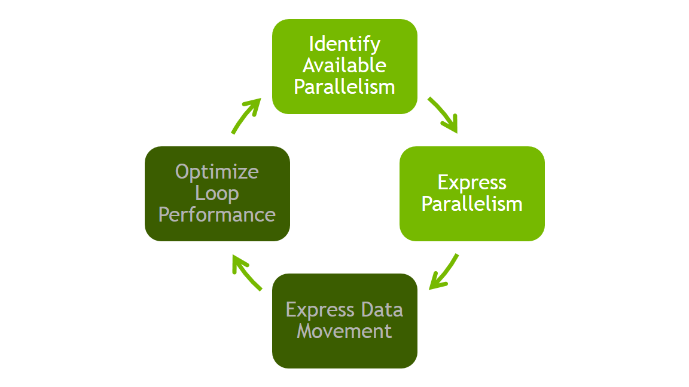

NVIDIA OpenACC Course - Lab 2
=============================

In this lab you will profile the provided application using either NVIDIA
nvprof or gprof and the PGI compiler. After profiling the application, you will
use OpenACC to express the parallelism in the 3 most time-consuming routines.
You will use CUDA Unified Memory and the PGI "managed" option to manage host
and device memories for you. You may use either the `kernels` or `parallel loop` 
directives to express the parallelism in the code. Versions of the code
have been provided in C99 and Fortran 90. The C99 version is available in the
`c99` directory and the F90 version is available in the `f90` directory.

As discussed in the associated lecture, this lab will focus solely on
Identifying Parallelism in the code by profiling the application and Expressing
Parallelism using OpenACC. We will use CUDA Unified Memory to allow the data
used on the GPU to be automatically migrated to and from the GPU as needed.
Please be aware that you may see an application slowdown until you have
completed each step of this lab. This is expected behavior due to the need to
migrate data between the CPU and GPU memories.

**Hint** You should repeat steps 2 and 3 for each function identified in step 1
in order of function importance. Gather a new GPU profile each time and observe
how the profile changes after each step.

Step 0 - Building the code
--------------------------

Makefiles have been provided for building both the C and Fortran versions of
the code. Change directory to your language of choice and run the `make`
command to build the code.

### C/C++

    $ cd c99/
    $ make
        
### Fortran

    $ cd f90/
    $ make
                
This will build an executable named `cg` that you can run with the `./cg`
command. You may change the options passed to the compiler by modifying the
`CFLAGS` variable in `c99/Makefile` or `FCFLAGS` in `f90/Makefile`. You should
not need to modify anything in the Makefile except these compiler flags.

Step 1 - Identify Parallelism
-----------------------------
In this step, use the NVPROF profiler, or your preferred performance analysis
tool, to idetify the important routines in the application and examine the
loops within these routines to determine whether they are candidates for
acceleration. Run the command below to gather a CPU profile.

    $ nvprof --cpu-profiling on --cpu-profiling-mode top-down ./cg
    Rows: 8120601, nnz: 218535025
    Iteration: 0, Tolerance: 4.0067e+08
    Iteration: 10, Tolerance: 1.8772e+07
    Iteration: 20, Tolerance: 6.4359e+05
    Iteration: 30, Tolerance: 2.3202e+04
    Iteration: 40, Tolerance: 8.3565e+02
    Iteration: 50, Tolerance: 3.0039e+01
    Iteration: 60, Tolerance: 1.0764e+00
    Iteration: 70, Tolerance: 3.8360e-02
    Iteration: 80, Tolerance: 1.3515e-03
    Iteration: 90, Tolerance: 4.6209e-05
    Total Iterations: 100
    
    ======== CPU profiling result (top down):
    99.87% main
    | 81.12% matvec(matrix const &, vector const &, vector const &)
    | 11.53% waxpby(double, vector const &, double, vector const &, vector const &)
    | 4.55% dot(vector const &, vector const &)
    | 2.65% allocate_3d_poisson_matrix(matrix&, int)
    | 0.03% free_matrix(matrix&)
    |   0.03% munmap
    0.13% __c_mset8
    
    ======== Data collected at 100Hz frequency

We see from the above output that the `matvec`, `waxpy`, and `dot` routines
take up the majority of the runtime of this application. We will focus our
effort on accelerating these functions.

***NOTE:*** The `allocate_3d_poisson_matrix` routine is an initialization
routine that can be safely ignored.

Step 2 - Express Parallelism
-----------------------------
Within each of the routines identified above, express the available parallelism
to the compiler using either the `acc kernels` or `acc parallel loop`
directive. As an example, here's the OpenACC code to add to the `matvec`
routine.

    void matvec(const matrix& A, const vector& x, const vector &y) {
    
      unsigned int num_rows=A.num_rows;
      unsigned int *restrict row_offsets=A.row_offsets;
      unsigned int *restrict cols=A.cols;
      double *restrict Acoefs=A.coefs;
      double *restrict xcoefs=x.coefs;
      double *restrict ycoefs=y.coefs;
    
    #pragma acc kernels
      {
        for(int i=0;i<num_rows;i++) {
          double sum=0;
          int row_start=row_offsets[i];
          int row_end=row_offsets[i+1];
          for(int j=row_start;j<row_end;j++) {
            unsigned int Acol=cols[j];
            double Acoef=Acoefs[j];
            double xcoef=xcoefs[Acol];
            sum+=Acoef*xcoef;
          }
          ycoefs[i]=sum;
        }
      }
    }

Add the necessary directives 
to each routine one at a time in order
of importance. After adding the directive, recompile the code, check that the
answers have remained the same, and note the performance difference from your
change.

    $ make
    pgc++ -fast -acc -ta=tesla:managed -Minfo=accel main.cpp -o cg
    "vector.h", line 16: warning: variable "vcoefs" was declared but never
              referenced
        double *vcoefs=v.coefs;
                ^
    
    matvec(const matrix &, const vector &, const vector &):
          8, include "matrix_functions.h"
              15, Generating copyout(ycoefs[:num_rows])
                  Generating
    copyin(xcoefs[:],Acoefs[:],cols[:],row_offsets[:num_rows+1])
              16, Loop is parallelizable
                  Accelerator kernel generated
                  Generating Tesla code
                  16, #pragma acc loop gang, vector(128) /* blockIdx.x threadIdx.x */
              20, Loop is parallelizable
              
The performance may slow down as you're working on this step. Be sure
to read the compiler feedback to understand how the compiler parallelizes the
code for you. If you are doing the C/C++ lab, it may be necessary to declare
some pointers as `restrict` in order for the compiler to parallelize them. You
will know if this is necessary if the compiler feedback lists a "complex loop
carried dependency."

Step 3 - Re-Profile Application
-------------------------------
Once you have added the OpenACC directives to your code, you should obtain a
new profile of the application. For this step, use the NVIDIA Visual Profiler
to obtain a GPU timeline and see how the the GPU computation and data movement
from CUDA Unified Memory interact. 

- If you are doing this lab on your own machine, either launch Visual Profiler
  from its application link or via the `nvvp` command.

Once Visual Profiler has started, create a new session by selecting *File -> New
Session*. Then select the executable that you built by pressing the *Browse*
button next to *File*, browse to your working directory, select the `cg`
executable, and then press *Next*. On the next screen ensure that
*Enable unified memory profiling* is checked and press *Finish*. The result
should look like the image below. Experiment with Visual Profiler to see what
information you can learn from it.

Conclusion
----------
After completing the above steps for each of the 3 important routines your
application should show a speed-up over the unaccelerated version. You can
verify this by removing the `-ta` flag from your compiler options. In the next
lecture and lab we will replace CUDA Unified Memory with explicit memory
management using OpenACC and then further optimize the loops using the OpenACC
loop directive.

Bonus
-----
1. If you used the `kernels` directive to express the parallelism in the code,
try again with the `parallel loop` directive. Remember, you will need to take
responsibility of identifying any reductions in the code. If you used 
`parallel loop`, try using `kernels` instead and observe the differences both in
developer effort and performance.
